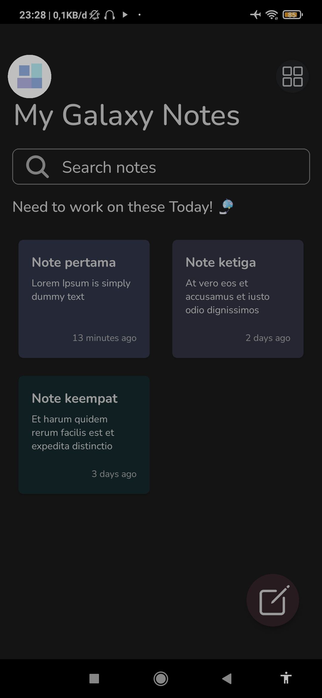
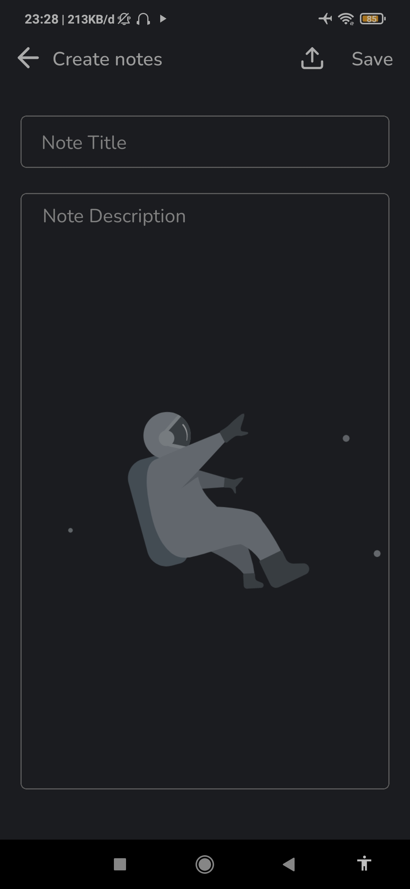
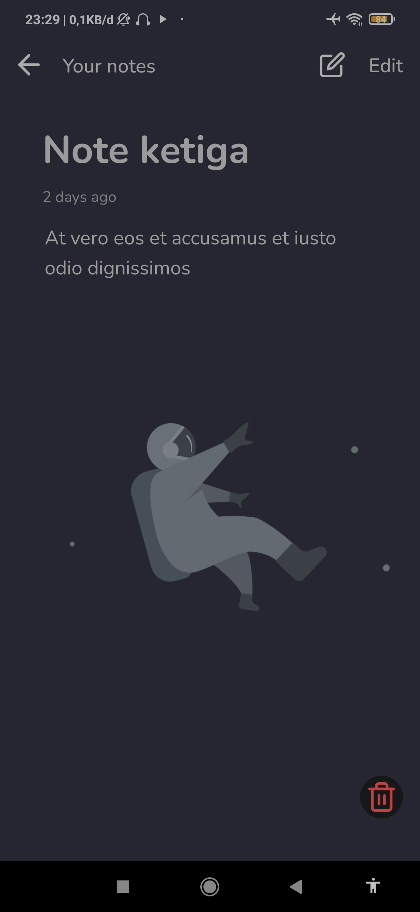

Berikut adalah README untuk repository "Galaxy Memo" dengan preview gambar yang diminta:

---

# Galaxy Memo

Galaxy Memo adalah aplikasi catatan berbasis React Native yang memungkinkan pengguna untuk membuat, menyimpan, dan melihat catatan mereka dengan mudah.

## Preview Aplikasi

### Homescreen



### Create Note Screen



### Detail Note Screen



## Fitur

- Buat catatan baru
- Simpan catatan dengan judul dan konten
- Lihat detail catatan yang telah disimpan
- Hapus catatan yang tidak diperlukan

## Instalasi

1. Clone repositori ini

   ```bash
   git clone https://github.com/Attta-pangestu/galaxy-memo-reactNative-app.git
   ```

2. Masuk ke direktori proyek

   ```bash
   cd galaxy-memo-reactNative-app
   ```

3. Instal dependensi

   ```bash
   npm install
   ```

4. Jalankan aplikasi

   ```bash
   npm start
   ```

## Teknologi yang Digunakan

- React Native
- Redux
- React Navigation

## Struktur Proyek

```
galaxy-memo-reactNative-app
│   README.md
│   package.json
│   App.js
└───assets
│   │   appPreview1.jpg
│   │   appPreview2.jpg
│   │   appPreview3.jpg
└───src
    └───components
    └───screens
    └───redux
```

## Kontribusi

Jika Anda ingin berkontribusi pada proyek ini, silakan buat pull request atau buka issue untuk mendiskusikan perubahan yang ingin Anda buat.

## Lisensi

Proyek ini dilisensikan di bawah [MIT License](LICENSE).

---

Silakan tambahkan informasi tambahan yang mungkin Anda anggap perlu.
